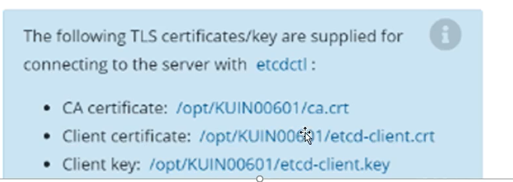

#### Tasks
1. Create a new snapshot of the existing etcd instance running at http://localhost:2379, saving the snapshot to /srv/data/etcd-snapshot.db
2. Restore an existing, previous snapshot located at /var/lib/backup/etcd-snapshot-previous.db

#### command
export ETCDCTL_API=3
etcdctl --endpoints "http://localhost:2379" --cacert-trusted=<ca-path> --cert=<cert-file> --key=<key-file> snapshot save /var/lib/backup/etcd-snapshot-previous.db

mkdir -p /opt/backup/
mv /etc/kubernetes/manifests/kube-* /opt/backup/
export ETCDCTL_API=3
etcdctl --endpoints "http://localhost:2379" --cacert-trusted=<ca-path> --cert=<cert-file> --key=<key-file> snapshot restore /var/lib/backup/etcd-snapshot-previous.db --data-dir=/var/lib/etcd-restore

vim /opt/backup/etcd.yaml, modify path to /var/lib/etcd-restore

mv /opt/backup/* /etc/kubernetes/manifests/
systemctl restart kubelet
 
#### ref doc 
> https://kubernetes.io/zh-cn/docs/tasks/administer-cluster/configure-upgrade-etcd/